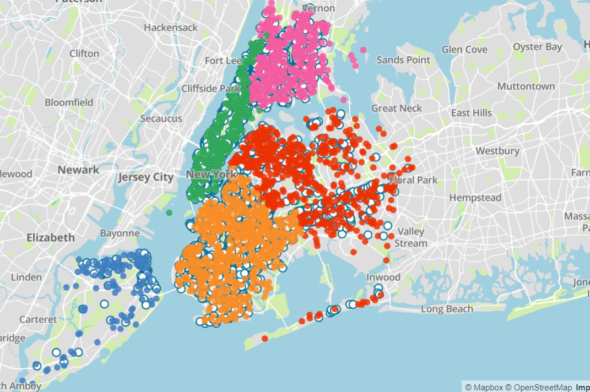

**Introduction**

Within the City of New York, does the prevalence and handling of graffiti differ between boroughs? The answer to these two questions is yes, and yes as shown by t-tests that we conducted to compare the mean length of time to resolve cases between boroughs.

**Background**

The data set contains 21303* observations which are each an instance of graffiti. Each observation has the borough, and neighborhood the graffiti was reported in, the date the incident was filed, and whether or not the case is open or closed. If the case is closed, there is a date for when the incident was closed. The data was collected via reports of graffiti made to the proper authorities, and the data was published by the Department of Sanitation (DSNY).

One major anomaly in the data is the number of cases in which the incident is not closed. Of the 21303 observations, 7,669 are still "ongoing"-- this number includes observations that were created over a year ago. 

Our goal for the rest of the report will be to analyze and compare and contrast the length of time from a case being opened to being closed between boroughs and whether there is evidence to say with statistical significance that the average case length does indeed differ between boroughs. Furthermore, we will include graphics that not only illustrate the aforementioned but highlight other areas of interest (ie graffiti per capita in the boroughs). 


**Analysis**

First, we tidy up and transform the data to fit the needs of our analysis by creating a column for the number of days for a case to be closed. We also made a column to say whether or not a case is open or closed. But first we will be looking at rates of graffiti in New York without respect whether the cases are open or closed: just prevalence within the boroughs.

```{r setup, include=FALSE}
## knitr options and package loading
knitr::opts_chunk$set(echo = FALSE, message=FALSE, warning=FALSE)
library(tidyverse)
library(lubridate)
library(zipcode)
library(ggmap)
library(maps)
library(knitr)
library(kableExtra)
##library(XML)
```

```{r viridis-defaults, include=FALSE, eval=TRUE}
## reset color defaults
## Source https://data-se.netlify.com/2018/12/12/changing-the-default-color-scheme-in-ggplot2/
library(viridis)
library(scales)

#### continuous variables color and fill
options(ggplot2.continuous.colour = "viridis")
options(ggplot2.continuous.fill = "viridis")

#### use viridis for discrete scales
scale_colour_discrete <- scale_colour_viridis_d
scale_fill_discrete <- scale_fill_viridis_d

## reset default theme
##theme_set(theme_minimal())
```

```{r read-data}
graffiti = read_csv("nyc_graffiti.csv")
```

#####Image of New York City with Each Point Being a Separate Case of Graffiti

**Color Coded by Borough:**

Manhattan: Green

The Bronx: Pink

Queens: Red

Brooklyn: Orange

Staten Island: Blue




```{r tidy-data}
graffiti = graffiti %>%
  # lowercase to make typing easier
  rename(borough = BOROUGH,
         address = INCIDENT_ADDRESS,
         community_board = COMMUNITY_BOARD,
         precinct = POLICE_PRECINCT,
         city_council = CITY_COUNCIL_DISTRICT,
         created = CREATED_DATE,
         closed = CLOSED_DATE,
         status = STATUS,
         action_taken = RESOLUTION_ACTION,
         lat = LATITUDE,
         long = LONGITUDE,
         zip = ZIP_CODE,
         neighborhood = NTA,
         location = LOCATION) %>%
  # lower case for the data cells
  mutate(borough = recode(borough,
                       "BROOKLYN" = "Brooklyn",
                       "MANHATTAN" = "Manhattan",
                       "BRONX" = "Bronx",
                       "QUEENS" = "Queens",
                       "STATEN ISLAND" = "Staten Island")) %>% 
  # variables we will looks at / would make for good future analysis
  select(address, borough, neighborhood, precinct, created, closed,
         status, zip, long, lat) %>% 
  # there is one observation of the 21304 that does not contain a borough
  filter(borough == "Manhattan" | borough == "Queens" | borough == "Brooklyn" | borough == "Bronx" | borough == "Staten Island") %>% 
  # transfroming the data by making a column with the number of days to close a case. NA if case is still open
  mutate(created = mdy(created),
         closed = mdy(closed),
         length = difftime(closed,created, units = "days")) %>% 
  filter(length >=0 | is.na(length))

# Testing to make sure there are no errors in the data
test = graffiti %>% 
  filter(status == "closed" & is.na(close))

test2 = graffiti %>% 
  filter(borough != "Manhattan" & borough != "Queens" & borough != "Brooklyn" & borough != "Bronx" & borough != "Staten Island")

test3 = graffiti %>% 
  filter(is.na(created))
```

**Prevalence of Graffiti in NYC**

```{r graf_per_cap_by_bor}

nyc_pop = read_csv("NYC_Population_by_Borough.csv") %>% 
  mutate(borough = recode(Borough,
                          "Brooklyn" = "Brooklyn",
                          "Manhattan" = "Manhattan",
                          "Bronx" = "Bronx",
                          "Queens" = "Queens",
                          "Staten Island" = "Staten Island"),
         population = Population) %>% 
  select(borough,population)

graffiti_pop = graffiti %>% 
  group_by(borough) %>% 
  mutate(cases = 1) %>% 
  summarize(cases = sum(cases)) %>% 
  left_join(nyc_pop,by="borough") %>% 
  mutate(case_per_cap = cases/population,
         pop_per_case = population/cases)

kable(graffiti_pop) %>%
  kable_styling(bootstrap_options = c("striped", "hover", "responsive"), full_width = F)

##number of cases graph ->

ggplot(graffiti_pop,aes(x=reorder(borough,-cases),y=cases,fill = borough)) +
  geom_col() +
  xlab("Borough") +
  ylab("Number of Cases") +
  ggtitle("Number of Cases of Graffiti by Borough")

##number of people per 10000 ->

ggplot(graffiti_pop, aes(x= reorder(borough, -case_per_cap), y=case_per_cap*10000, fill = borough)) +
  geom_col() +
  xlab("Borough") +
  ylab("Number of people who graffitied") +
  ggtitle("Number of People Who Have Graffitied For Every 10,000 People by Borough",
          subtitle = "Assuming that each case was a different person")
```

**Addressing "Complete" Data**
As mentioned above, 7669 cases in the data set are not closed-- we will address those cases later in the project. For now, we will only be looking at observations for which there is an open and a closed date. 

```{r mean-sd-boroughs-closed}
closed_graffiti = graffiti %>% 
  filter(!is.na(length)) %>% 
  mutate(city_mean = as.numeric(mean(length)))

closed_summary = closed_graffiti %>% 
  group_by(borough) %>% 
  summarize(mean = as.numeric(mean(length)),
            sd = sd(length),
            total = NROW(length))

kable(closed_summary) %>%
  kable_styling(bootstrap_options = c("striped", "hover", "responsive"), full_width = F)

ggplot(graffiti, aes(x = borough, y = length, color = borough)) +
  geom_boxplot() +
  geom_hline(yintercept = closed_graffiti$city_mean, color = "red", lty = 2) + # TODO add y intercept of mean days across city to close
  ggtitle("Boxplots of Number of Days to Resolve Graffiti Cases by Borough",
          subtitle = "Of cases that are closed")

ggplot(closed_graffiti, aes(x = length)) +
  geom_density() +
  facet_wrap(~ borough) +
  xlab("Number of Days to Resolve Incident") +
  ylab("Density") +
  ggtitle("Density Plots by Borough of Number of Days to Resolve Graffiti Incidents", subtitle = "Of cases that are closed")


```

**Tests for Statistical Significance of Closed Data**

Looking at these bar graphs, boxplot, and density plot alone, it seems that the average number of days to resolve a case is quite similar between the boroughs. 

Is there a difference between the average length of time to close a graffiti case for all borough's?
Conducting an ANOVA test:

Alternate Hypothesis: The means are different

Null Hypothesis: The means are the same

We expect a p-value of ~0.0 if the alternate hypothesis is true
```{r anova-test, echo=TRUE}
anova_data = closed_graffiti %>%
  group_by(borough) %>%
  summarize(count = n(),
         mean = as.numeric(mean(length)),
         sd = sd(length))


res.aov <- aov(length ~ borough, data = closed_graffiti)
summary(res.aov)
summary(res.aov)[[1]][["Pr(>F)"]][[1]]
```
The resulting p value from the ANOVA test is 1.214099e-45. From this information we can prove with a high degree of statistical certainty that the means are different and the alternate hypothesis is true.

Is there evidence to suggest that there is indeed a statistically signifigant difference between boroughs however? We use t tests to compare.

```{r t-test function, echo= TRUE}
# Algorithm: Compare two means to see if the difference between the two is statistically significant.
# return: the  score from a two sided test assuming the null hypothesis is true. 
t_test = function(mean1, sd1, total1, mean2, sd2, total2)
{
  z = (mean1 - mean2) / sqrt((sd1*sd1 / total1) + (sd2*sd2 / total2))
  if (total1 > total2) {
    df = total2 - 1
  }
  else { df = total1 - 1 }
  
  p_val = pt(z, df)
  return (p_val)
}
```

Is there a difference between how the average length of time to close a graffiti case in Manhattan vs Brooklyn? 

Conducting a t-test results in the following:

```{r data-by-borough-closed}
Manhattan = closed_graffiti %>%
  filter(borough == "Manhattan") %>% 
  mutate(mean = as.numeric(mean(length)),
         sd = sd(length),
         total = NROW(length)) %>% 
  select(mean, sd, total) %>% 
  distinct()
Brooklyn = closed_graffiti %>%
  filter(borough == "Brooklyn") %>% 
  mutate(mean = as.numeric(mean(length)),
         sd = sd(length),
         total = NROW(length)) %>% 
  select(mean, sd, total) %>% 
  distinct()
Queens = closed_graffiti %>%
  filter(borough == "Queens") %>% 
  mutate(mean = as.numeric(mean(length)),
         sd = sd(length),
         total = NROW(length)) %>% 
  select(mean, sd, total) %>% 
  distinct()
Bronx = closed_graffiti %>%
  filter(borough == "Bronx") %>% 
  mutate(mean = as.numeric(mean(length)),
         sd = sd(length),
         total = NROW(length)) %>% 
  select(mean, sd, total) %>% 
  distinct()
staten_island = closed_graffiti %>%
  filter(borough == "Staten Island") %>% 
  mutate(mean = as.numeric(mean(length)),
         sd = sd(length),
         total = NROW(length)) %>% 
  select(mean, sd, total) %>% 
  distinct()

```

```{r Manhattan-Brooklyn-t test-closed, echo = TRUE}
# Ho: mu Manhattan = mu Brooklyn
# Ha: mu Manhattan =/= mu Brooklyn
t_test(Brooklyn$mean, Brooklyn$sd, Brooklyn$total,
       Manhattan$mean, Manhattan$sd, Manhattan$total)

```
We can expect to see the difference of these means occuring 0.388% of the time. Thus, there is a high statistical significance that the mean number of days to close a graffiti case differs between Brooklyn and Manhattan.

Is there a difference between how the average length of time to close a graffiti case in Queens vs Bronx? Conducting a t-test results in the following:
```{r Queens-Bronx-t test-closed, echo = TRUE}
# Ho: mu Queens = mu Bronx
# Ha: mu Queens =/= mu Bronx
t_test(Bronx$mean, Bronx$sd, Bronx$total,
       Queens$mean, Queens$sd, Queens$total)

```
We can expect to see the difference of these means occuring ~0.0% of the time. Thus, there is a very high statistical significance that the mean number of days to close a graffiti case differs between Queens and the Bronx.

**Addressing Missing Data**

As stated in the introduction, 36% of the observations are not "closed". For many this might be because the city has not yet had the opportunity to clean up the graffiti, but for some it might be due to administrative error (the case is closed but was not marked as such) or the city forgot about the case.

To address this we created a new df 'open_graffiti' which contains only the 36% of observations that are not closed. We used mutate to add a column 'since_open' which is the number of days since the most recent date (Oct 14 2019). For some this value will be 0 because the case was opened the day this data was publish, for others it will be a number of days exceeding a year and everything in between.

**Top Six Observations on the open_graffiti Dataset**

```{r create-open_graffiti}
open_graffiti = graffiti %>% 
  filter(is.na(length)) %>% 
  # call to floor because initially a decimal was returned.
  # since_open is the number of days since the most recent date in the data: 10/14/19
  mutate(since_open = floor(difftime("2019-10-14",created, units = "days"))) %>%
  select(-c(neighborhood, precinct, zip))

kable(cbind(head(open_graffiti))) %>%
  kable_styling(bootstrap_options = c("striped", "hover", "responsive"), full_width = F)
#  scroll_box(width = "100%", height = "200px")
```

How do we separate out cases that are still being worked on vs cases where extending factors might be at play?

Here we take the 95th percentiles for 'length' from the df 'closed_graffiti'. Our logic is that if the value of 'since open' for an open case is greater than the value of the 95th quantile of 'length' of closed_graffiti, we might assume either or a combination of the following. 

  1. There was an administrative error and a case actually is closed but was not marked as such.
  2. The case was simply forgotten about or ignored by the Department of Sanitation.
  3. Another factor we have failed to consider. 

```{r quantiles-length-closed}
quantile(closed_graffiti$length, 0.95)

```

Of all closed observations of graffiti in NYC, 95% of the cases were closed in 154 days or less. Now, we will take the number of cases by borough that are older than 154 days over the total number of open cases in the borough. This will give us 5 proportions, 1 for each borough, of 'issue' cases / total_cases. The larger the proportion, the more cases in that particular borough that are open AND 'very old'. 

```{r issue-proportion}
open_graffiti = open_graffiti %>% 
  mutate(issue = since_open > 154,
         count = 1)

open_summary = open_graffiti %>% 
  group_by(borough) %>%
  summarize(total_issue = sum(issue),
            total_open = sum(count),
            prop = total_issue / total_open)

kable(open_summary) %>%
  kable_styling(bootstrap_options = c("striped", "hover", "responsive"), full_width = F)
```

This graph displays those proportions. In addition, the size of each plot corresponds to the size of the mean number of days to close a case. The lower the placement of the dot, the less 'issue cases' that borough has. The smaller the dot, the faster closed cases are closed. Simply, a smaller lower placed dot can be interpreted as "good" and a larger higher placed dot as "bad". 

```{r issue-proportion-graph}
ggplot(open_summary) +
  geom_segment(aes(x=borough, y=prop, xend=borough, yend=0)) +
  geom_point(aes(x = borough, y = prop, size = closed_summary$mean, color = borough)) +
  xlab("Borough") +
  ylab("Proportion") +
  labs(size = "Mean Days to Close a Case", color = "Borough") +
  ggtitle("Proportion of Cases by Borough Categorized as 'Issue Cases'", subtitle = "With size representing the mean number of days to close a case")
```

### Maps

```{r staten-island-closedOpen-map, echo=FALSE, fig.height=5, warning=FALSE}
dx = 0.2
dy = 0.1
mad_coords = c(left = -74.16 - dx,
               right = -74.16 + dx,
               bottom = 40.56 - dy,
               top = 40.56+ dy)
staten_island_map = get_stamenmap(mad_coords, maptype = "terrain", zoom = 12)

staten_island_closed = closed_graffiti %>%
  filter(borough == "Staten Island") #TODO capitalize manhattan
staten_island_open = open_graffiti %>%
  filter(borough == "Staten Island")

ggmap(staten_island_map) +
  geom_point(aes(x=long,y=lat), data = staten_island_closed, color = "darkblue", size = 1) +
  geom_point(aes(x=long,y=lat), data = staten_island_open, color = "red", size = 1) +
  ggtitle("Staten Island Closed and Open Cases", subtitle = "Open = Red, Closed = Blue") +
  theme_void()

#Citation for Code: Bret Larget, PhD
```


```{r manhattan-closedOpen-map, echo=FALSE, fig.height=5, warning=FALSE}
dx = 0.2
dy = 0.1
mad_coords = c(left = -73.96 - dx,
               right = -73.96 + dx,
               bottom = 40.78 - dy,
               top = 40.78 + dy)
manhattan_map = get_stamenmap(mad_coords, maptype = "terrain", zoom = 12)

manhattan_closed = closed_graffiti %>%
  filter(borough == "Manhattan") #TODO capitalize manhattan
manhattan_open = open_graffiti %>%
  filter(borough == "Manhattan")

ggmap(manhattan_map) +
  geom_point(aes(x=long,y=lat), data = manhattan_closed, color = "darkblue", size = 0.5, alpha = 0.35) +
  geom_point(aes(x=long,y=lat), data = manhattan_open, color = "red", size = 0.5, alpha = 0.35) +
  ggtitle("Manhattan Closed and Open Cases", subtitle = "Open = Red, Closed = Blue") +
  theme_void()
rm(foo)

#Citation for Code: Bret Larget, PhD
```


```{r bronx-closedOpen-map, echo=FALSE, fig.height=5, warning=FALSE}
dx = 0.2
dy = 0.1
mad_coords = c(left = -73.87 - dx,
               right = -73.87 + dx,
               bottom = 40.85 - dy,
               top = 40.85 + dy)
bronx_map = get_stamenmap(mad_coords, maptype = "terrain", zoom = 12)

bronx_closed = closed_graffiti %>%
  filter(borough == "Bronx") #TODO capitalize manhattan
bronx_open = open_graffiti %>%
  filter(borough == "Bronx")

ggmap(bronx_map) +
  geom_point(aes(x=long,y=lat), data = bronx_closed, color = "darkblue", size = 0.5, alpha = 0.35) +
  geom_point(aes(x=long,y=lat), data = bronx_open, color = "red", size = 0.5, alpha = 0.35) +
  ggtitle("Bronx Closed and Open Cases", subtitle = "Open = Red, Closed = Blue") +
  theme_void()
rm(foo)

#Citation for Code: Bret Larget, PhD
```


```{r queens-closedOpen-map, echo=FALSE, fig.height=5, warning=FALSE}
dx = 0.2
dy = 0.16
mad_coords = c(left = -73.82 - dx,
               right = -73.82 + dx,
               bottom = 40.69 - dy,
               top = 40.69 + dy)
queens_map = get_stamenmap(mad_coords, maptype = "terrain", zoom = 12)

queens_closed = closed_graffiti %>%
  filter(borough == "Queens")
queens_open = open_graffiti %>%
  filter(borough == "Queens")

ggmap(queens_map) +
  geom_point(aes(x=long,y=lat), data = queens_closed, color = "darkblue", size = 0.5, alpha = 0.35) +
  geom_point(aes(x=long,y=lat), data = queens_open, color = "red", size = 0.5, alpha = 0.35) +
  ggtitle("Queens Closed and Open Cases", subtitle = "Open = Red, Closed = Blue") +
  theme_void()
rm(foo)

#Citation for Code: Bret Larget, PhD
```


```{r brooklyn-closedOpen-map, echo=FALSE, fig.height=5, warning=FALSE}
dx = 0.2
dy = 0.1
mad_coords = c(left = -73.93 - dx,
               right = -73.93 + dx,
               bottom = 40.66 - dy,
               top = 40.66 + dy)
brooklyn_map = get_stamenmap(mad_coords, maptype = "terrain", zoom = 12)

brooklyn_closed = closed_graffiti %>%
  filter(borough == "Brooklyn")
brooklyn_open = open_graffiti %>%
  filter(borough == "Brooklyn")

ggmap(brooklyn_map) +
  geom_point(aes(x=long,y=lat), data = brooklyn_closed, color = "darkblue", size = 0.5, alpha = 0.35) +
  geom_point(aes(x=long,y=lat), data = brooklyn_open, color = "red", size = 0.5, alpha = 0.35) +
  ggtitle("Brooklyn Closed and Open Cases", subtitle = "Open = Red, Closed = Blue") +
  theme_void()
rm(foo)

#Citation for Code: Bret Larget, PhD
```

**Discussion**

We can see from the ANOVA test and t-tests that there is indeed a statistically significant difference in the average number of days for a graffiti case to be resolved between boroughs. Surprisingly to us the borough that has the smallest mean-- the fastest case closure per se-- is the Bronx. We thought that it would be Manhattan given that tourists frequent Manhattan more than any other borough and we believed the city would want tourists to see as little graffiti as possible. Furthermore, based upon the graffiti per capita we learned that Staten Island while having the smallest population of the five boroughs has the most graffiti per person. An interesting route of inquiry to pursue regarding this data might compare the prevalence of another type of crime-- ie burglary-- with the prevalence of graffiti and ask questions such as "is there an association between the prevalence of graffiti and other crimes, and does such other crimes follow the same patterns by borough as graffiti?".
